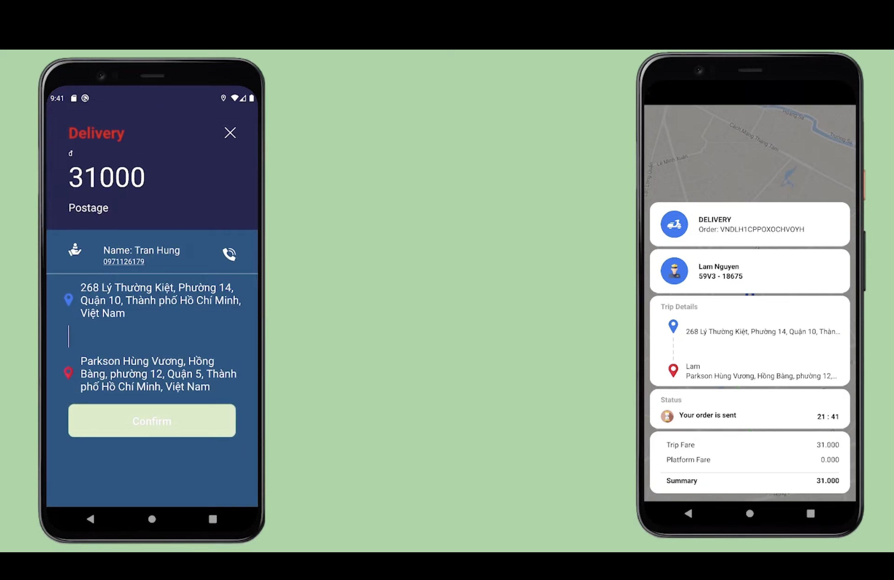

# Book-bike

 <h1 align="center">(React Native) Booking Rider System</h1>

## Introduction

**Here is my React Native source code for real-time booking rider system capable of finding riders, tracking delivery process with google maps, tracking delivery history, get notification with Firebase**

    

        

              
        
    
    
    

## Result
Please refer to this video link to see how this system works: https://www.youtube.com/watch?v=rUcRkUkw4FY

## Features
1. For clients
- Booking a Ride.
- Booking a Delivery.
- Finding Riders.
- Deal the Price Base On Distance with Riders
- Get Information About The Road, Distance, Location of Rider through Google Map APIs
- Get Notification About Delivery Process By Using Firebase
- Managing User Information

2. For riders
- Get Information about Ride
- Confirm / Cancel Ride
- Get Suggestion Road by Using Google Map APIs
- Clear Process From Get a Ride to Finish a Ride
- Get Notification By Using Firebase
- Managing User Information

## Instalation
1. Simply clone the project from this project.
2. Run "npm install" or "yarn" to install node_modules.
3. Run "npm start" then "npm run ios" for IOS simulator or "npm run android" for Android emulator.
